# Components

Everything placeable on the canvas (tab 1's right-click menu) comes from
the vendored `@wokwi/elements` fork (`simulators/iot-elements`, MIT) -
see [ARCHITECTURE.md](ARCHITECTURE.md)'s "Vendoring @wokwi/elements"
section for how it's built into the app. This file is the registry: what's
wired up today, and how to add more. Preview images are the element's own
real rendered SVG (extracted live from the running app, not hand-drawn),
each shown at its own smaller side's size so proportions stay honest.

## Boards

Backed by a `SimulatorAdapter` (CPU emulation - see
[ARCHITECTURE.md](ARCHITECTURE.md)) and powered by Start/Pause/Stop.
Registered in `web/shell/src/circuit.ts`. Every board runs a JS-native
sketch runtime now (no C/C++ toolchain, no vendored Arduino/pico-sdk/
ESP-IDF core).

| Board | Custom element | Adapter | Fork | Preview |
|---|---|---|---|---|
| Arduino Uno | `iot-arduino-uno` | `avr8-js` | `vecnode/iot-elements` |  |
| Arduino Nano | `iot-arduino-nano` | `avr8-js` | `vecnode/iot-elements` |  |
| Arduino Mega | `iot-arduino-mega` | `avr8-js-mega` | `vecnode/iot-elements` |  |
| Franzininho | `iot-franzininho` | `avr8-js-attiny85` | `vecnode/iot-elements` | 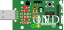 |
| Arduino Leonardo | `iot-arduino-leonardo` | `avr8-js` | `vecnode/iot-elements` | 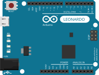 |
| Arduino Nano RP2040 Connect | `iot-nano-rp2040-connect` | `rp2040-js` | `vecnode/iot-elements` | 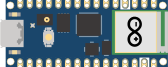 |
| Raspberry Pi Pico | `iot-pi-pico` | `rp2040-js` | `vecnode/iot-elements` |  |
| Raspberry Pi Pico W | `iot-pi-pico-w` | `rp2040-js` | `vecnode/iot-elements` | 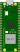 |
| ESP32 DevKit V1 | `iot-esp32-devkit-v1` | `esp32-js` | `vecnode/iot-elements` | 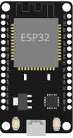 |
| ESP32 DevKit C V4 | `iot-esp32-devkit-c-v4` | `esp32-js` | `vecnode/iot-elements` |  |
| ESP32-CAM | `iot-esp32-cam` | `esp32-js` | `vecnode/iot-elements` | 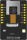 |


## Components

Placed via the canvas's right-click. No power/adapter
state - purely placed and wireable (see [ARCHITECTURE.md](ARCHITECTURE.md)'s
"pin-to-pin connections" section). Registered in
`web/shell/src/component-registry.ts`.

| Component | Custom element | Fork | Preview |
|---|---|---|---|
| DHT22 (Temp/Humidity) | `iot-dht22` | `vecnode/iot-elements` | 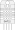 |
| HC-SR04 (Ultrasonic) | `iot-hc-sr04` | `vecnode/iot-elements` |  |
| Flame Sensor | `iot-flame-sensor` | `vecnode/iot-elements` | 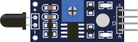 |
| Gas Sensor | `iot-gas-sensor` | `vecnode/iot-elements` | 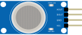 |
| Heart Beat Sensor | `iot-heart-beat-sensor` | `vecnode/iot-elements` |  |
| IR Receiver | `iot-ir-receiver` | `vecnode/iot-elements` | 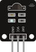 |
| MPU6050 (Accel/Gyro) | `iot-mpu6050` | `vecnode/iot-elements` |  |
| NTC Temperature Sensor | `iot-ntc-temperature-sensor` | `vecnode/iot-elements` | 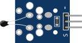 |
| Photoresistor | `iot-photoresistor-sensor` | `vecnode/iot-elements` | 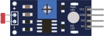 |
| PIR Motion Sensor | `iot-pir-motion-sensor` | `vecnode/iot-elements` |  |
| Small Sound Sensor | `iot-small-sound-sensor` | `vecnode/iot-elements` | 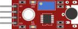 |
| Big Sound Sensor | `iot-big-sound-sensor` | `vecnode/iot-elements` |  |
| Tilt Switch | `iot-tilt-switch` | `vecnode/iot-elements` | 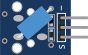 |
| HX711 (Load Cell Amp) | `iot-hx711` | `vecnode/iot-elements` | 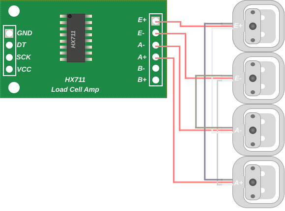 |
| LED | `iot-led` | `vecnode/iot-elements` |  |
| RGB LED | `iot-rgb-led` | `vecnode/iot-elements` |  |
| LED Ring | `iot-led-ring` | `vecnode/iot-elements` |  |
| LED Bar Graph | `iot-led-bar-graph` | `vecnode/iot-elements` |  |
| NeoPixel | `iot-neopixel` | `vecnode/iot-elements` |  |
| NeoPixel Matrix | `iot-neopixel-matrix` | `vecnode/iot-elements` |  |
| 7-Segment Display | `iot-7segment` | `vecnode/iot-elements` |  |
| LCD1602 | `iot-lcd1602` | `vecnode/iot-elements` |  |
| LCD2004 | `iot-lcd2004` | `vecnode/iot-elements` |  |
| SSD1306 (OLED) | `iot-ssd1306` | `vecnode/iot-elements` | 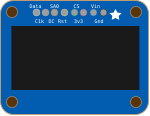 |
| ILI9341 (TFT) | `iot-ili9341` | `vecnode/iot-elements` |  |
| Buzzer | `iot-buzzer` | `vecnode/iot-elements` |  |
| Servo Motor | `iot-servo` | `vecnode/iot-elements` |  |
| Stepper Motor | `iot-stepper-motor` | `vecnode/iot-elements` | 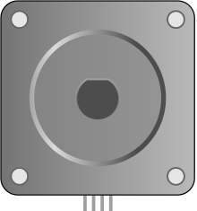 |
| Biaxial Stepper | `iot-biaxial-stepper` | `vecnode/iot-elements` |  |
| Resistor | `iot-resistor` | `vecnode/iot-elements` | 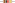 |
| Capacitor | `iot-capacitor` | `vecnode/iot-elements` |  |
| Potentiometer | `iot-potentiometer` | `vecnode/iot-elements` |  |
| Slide Potentiometer | `iot-slide-potentiometer` | `vecnode/iot-elements` |  |
| Pushbutton | `iot-pushbutton` | `vecnode/iot-elements` |  |
| Pushbutton (6mm) | `iot-pushbutton-6mm` | `vecnode/iot-elements` |  |
| Slide Switch | `iot-slide-switch` | `vecnode/iot-elements` |  |
| DIP Switch (8-way) | `iot-dip-switch-8` | `vecnode/iot-elements` |  |
| Membrane Keypad | `iot-membrane-keypad` | `vecnode/iot-elements` | 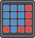 |
| Rotary Dialer | `iot-rotary-dialer` | `vecnode/iot-elements` | 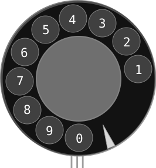 |
| Relay (KS2E-M-DC5) | `iot-ks2e-m-dc5` | `vecnode/iot-elements` |  |
| DS1307 (RTC) | `iot-ds1307` | `vecnode/iot-elements` |  |
| MicroSD Card | `iot-microsd-card` | `vecnode/iot-elements` |  |
| Analog Joystick | `iot-analog-joystick` | `vecnode/iot-elements` |  |
| Rotary Encoder (KY-040) | `iot-ky-040` | `vecnode/iot-elements` | 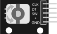 |
| IR Remote | `iot-ir-remote` | `vecnode/iot-elements` |  |

## Originally-drawn parts

docs.wokwi.com lists more parts than Wokwi ever open-sourced - these 24
exist only in Wokwi's closed-source simulator, so there was no MIT source
to vendor. Each is an original element added directly to
`vecnode/iot-elements` (same "small, original, not copied from Wokwi"
precedent the fork's own `iot-capacitor` already set - see that
submodule's README for the full list and reasoning). Visual/wireable
only, same tier as most parts in the tables above - no board here has a
`SimulatorAdapter`, even the four that look like MCU dev boards.

| Component | Custom element | Preview |
|---|---|---|
| BMP180 (Pressure) | `iot-bmp180` | 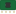 |
| DS18B20 (1-Wire Temp) | `iot-ds18b20` |  |
| MFRC522 (RFID) | `iot-mfrc522` | 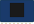 |
| Logic Analyzer | `iot-logic-analyzer` | 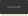 |
| 74HC165 (Shift-In) | `iot-74hc165` |  |
| 74HC595 (Shift-Out) | `iot-74hc595` |  |
| NLSF595 (Shift-Out) | `iot-nlsf595` |  |
| ATtiny85 (bare chip) | `iot-attiny85` |  |
| A4988 (Stepper Driver) | `iot-a4988` | 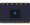 |
| Clock Generator | `iot-clock-generator` | 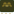 |
| Grove OLED (SH1107) | `iot-grove-oled-sh1107` |  |
| LED Matrix (8x8) | `iot-led-matrix` | 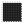 |
| LED Strip | `iot-led-strip` |  |
| MAX7219 Matrix | `iot-max7219-matrix` | 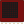 |
| Nokia 5110 Screen | `iot-nokia-5110-screen` | 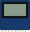 |
| Relay Module | `iot-relay-module` | 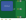 |
| Text Label | `iot-text` |  |
| TM1637 7-Segment | `iot-tm1637-7segment` | 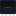 |
| TV (Composite) | `iot-tv` |  |
| WiFi Access Point | `iot-wifi-ap` | 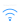 |
| Franzininho WiFi (visual only) | `iot-franzininho-wifi` | 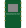 |
| Nucleo C031C6 (visual only) | `iot-nucleo-c031c6` | 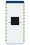 |
| Nucleo L031K6 (visual only) | `iot-nucleo-l031k6` |  |
| STM32 Blue Pill (visual only) | `iot-stm32-bluepill` | 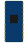 |

## Adding a new sensor or connection

The custom element itself is already available - `main.ts`'s
`import "@wokwi/elements"` registers every element the vendored fork
exports (`simulators/iot-elements/src/index.ts`), not just the ones
listed above. Adding one to the menu is a single entry in
`web/shell/src/component-registry.ts`'s `componentRegistry`:

```ts
"my-new-part": {
  tagName: "iot-my-new-part",
  displayName: "My New Part",
  category: "sensors", // or "connections"
},
```

That's it - no other file needs to change. The right-click menu
(`web/shell/src/canvas/context-menu.ts`), placement, dragging, and pin
markers (`web/shell/src/canvas/scene.ts`) all read from this one
registry, so a new entry here is automatically placeable, draggable,
wireable, and deletable like every other component. If the part isn't in
the vendored fork yet at all, add it under
`simulators/iot-elements/src/` first (see that submodule's own
`CONTRIBUTING.md`) - it needs a `pinInfo: ElementPin[]` property for its
pins to show up as clickable/wireable markers, but works without one too
(just with no pins to connect).

## Adding a new board

A board additionally needs a `SimulatorAdapter` to actually run - not
just an element to look at. Three registries in
`web/shell/src/circuit.ts`, keyed by the same board-type string:

- `boardTagName` - the custom element tag (as above).
- `boardDisplayName` - the label shown in the right-click "Boards" menu.
- `boardAdapterId` - which `SimulatorAdapter` (`web/common/src/
  adapter-types.ts`) backs it. `avr8-js` and `rp2040-js` already exist
  (`web/adapters/{avr8-js,rp2040-js}`) as JS-native, no-compiler runtimes;
  a genuinely new architecture needs a new adapter package first (see
  [ARCHITECTURE.md](ARCHITECTURE.md)'s "Two adapter kinds" section for
  what that involves).
- `boardPowerSetter` - how Start/Stop reflects onto the element (Arduino
  Uno's power LED, for instance) - board-specific since not every board
  exposes the same property.

Also worth adding, if the board should support pin read/write (not just
placement): a pin-name map in `web/common/src/boards/` (see
`arduino-uno.ts`), mapping the board's silkscreen names to the backing
adapter's raw pin ids - and a `PowerProfile` entry in
`web/shell/src/energy.ts`'s `boardPowerProfile` so the voltage/current
readout means something for the new board type instead of reading zero.
